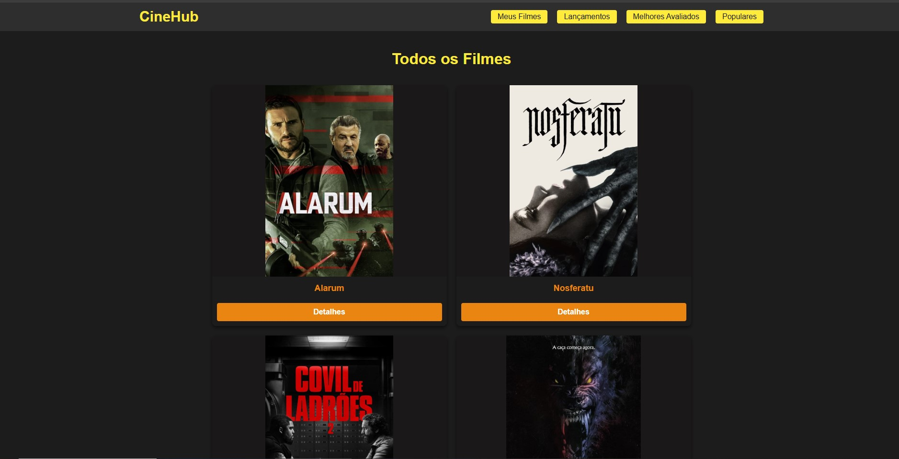
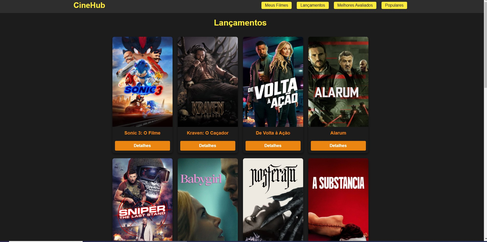
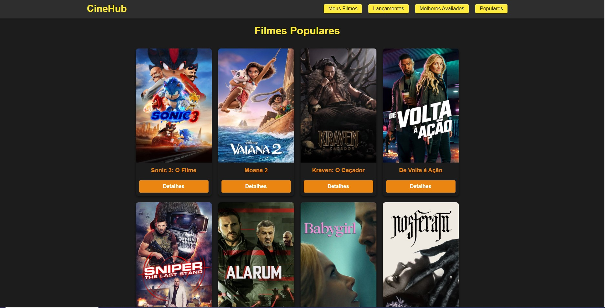

# 🎬 CineHub

CineHub é uma plataforma web para consulta de filmes populares, melhores avaliados, lançamentos e um sistema de favoritos. Os dados são consumidos da API do TMDB.

## ⚙ Tecnologias Utilizadas

- **JavaScript**
- **React.js**
- **CSS**
- **API do TMDB**

## 📌 Funcionalidades

### 📺 Home Page
A Home Page exibe uma lista com **20 filmes** consumidos da API, apresentados em um layout configurado com **grid-template-columns: 2, 1fr**. Cada cartão de filme contém:
- **Imagem do filme**
- **Título**
- **Botão de Detalhes**
- **Botão de Salvar**

Ao clicar em **Detalhes**, o usuário é redirecionado para uma página específica do filme, que contém:
- **Sinopse**
- **Banner**
- **Nota da crítica**
- **País de origem**
- **Botão de Salvar** (adiciona o filme na aba "Meus Filmes")
- **Botão de Trailer** (direciona para uma busca do título no YouTube)



---

### ⭐ Meus Filmes
A aba **Meus Filmes** exibe os filmes que foram salvos pelo usuário.
Nessa página é possível:
- **Visualizar os detalhes do filme**
- **Remover o filme da lista de favoritos**

A remoção é feita utilizando a seguinte lógica:
```javascript
function excluirFilme(id){
  let filtroFilmes = filmes.filter((item) => {
      return (item.id !== id)
  })
  setFilmes(filtroFilmes);
  localStorage.setItem("@cinehub", JSON.stringify(filtroFilmes))
  toast.success("Filme removido com sucesso!")
}
```


---

### 🎥 Lançamentos
A aba **Lançamentos** consome a API `/movie/now_playing` e exibe os filmes mais recentes em exibição.
- Layout configurado com **grid-template-columns: repeat(4, 1fr)**
- Botões de **Detalhes** e **Salvar** seguem o mesmo padrão da Home Page.



---

### 🏆 Melhores Avaliados
A aba **Melhores Avaliados** consome a API `/movie/top_rated`, exibindo os filmes com as melhores notas.
- Layout idêntico ao da aba Lançamentos.


---

### 🔥 Populares
A aba **Populares** consome a API `/movie/popular`, trazendo os filmes mais assistidos e comentados no momento.
- Segue o mesmo layout das abas anteriores.



---

## Como Rodar o Projeto

### Pré-requisitos
Antes de começar, você precisará ter instalado em sua máquina:
- **Node.js**
- **NPM** ou **Yarn**

### Passo a Passo
1. Clone este repositório:
```bash
git clone https://github.com/WesleyBSa/cine-hub.git
```

2. Acesse a pasta do projeto:
```bash
cd cinehub
```

3. Instale as dependências:
```bash
npm install
# ou
yarn install
```

4. Crie um arquivo `.env` na raiz do projeto e adicione sua chave da API do TMDB:
```
REACT_APP_API_KEY=SUA_CHAVE_AQUI
```

5. Inicie o servidor:
```bash
npm start
# ou
yarn start
```

O projeto estará disponível em `http://localhost:3000`.

---

## 💡 Considerações Finais
CineHub é um projeto criado para explorar o consumo de APIs no React e a manipulação de estados. Sinta-se à vontade para contribuir ou personalizar conforme suas necessidades!


